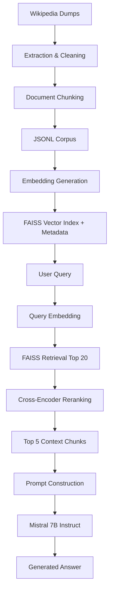

# RAG-Project
Experiment creating a RAG using wikipedia data

Note: The sample files represent an initial proof-of-concept RAG implementation built using a small subset of Wikipedia data. The pipeline files reflect the effort to process, embed, and index large-scale Wikipedia corpora for retrieval-augmented generation.

Created and run using Google Colab, .py file are for keeping and reference

Step 1: Extract data from wikipedia
Converted raw Wikipedia dump files into clean article text suitable for downstream NLP processing. Produced a corpus that could later be chunked, embedded, indexed in FAISS, and used for retrieval.

Google Colab link: https://colab.research.google.com/drive/1f4DUd_M1qRtUsArn4NXbmgqAXZZw1bK-?usp=sharing

Step 2: Embed the data and store them in FAISS for search

The cleaned Wikipedia corpus is chunked and converted into dense vector embeddings using the BAAI/bge-small-en Sentence Transformer model. Embeddings are indexed in FAISS to enable efficient semantic similarity search over millions of document chunks. Metadata and UID mappings are stored separately to associate retrieved vectors with their corresponding article titles, sections, and content before passing the retrieved context to the language model.

https://colab.research.google.com/drive/1ELh3W9zAgpCA1S4yrUI68CpLlEtiBo0q#scrollTo=9-u-6jCLXLE7

Step 3: RAG

The RAG pipeline embeds user queries using all-mpnet-base-v2, retrieves the top 20 candidate passages from a FAISS index, reranks them with the MS MARCO CrossEncoder, and selects the top 5 passages as context. Retrieved context is then provided to Mistral-7B-Instruct to generate grounded answers.

https://colab.research.google.com/drive/11p6B6drkzJfkChaPGBiOOS9vZCLbsxfq?usp=sharing

## Overall Flow

